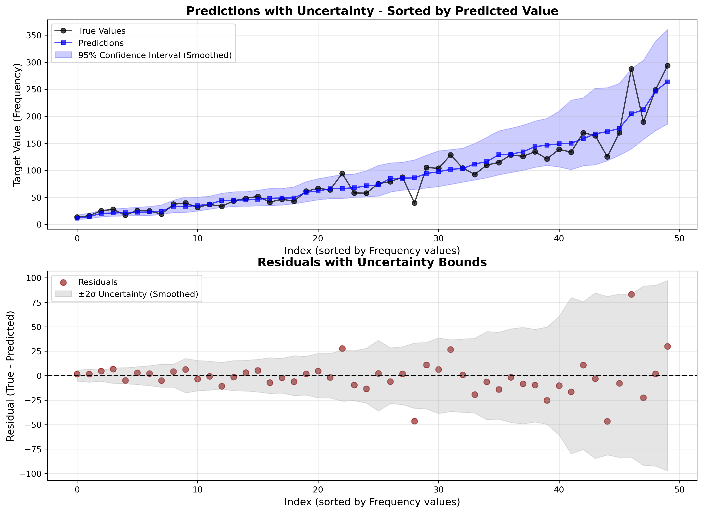
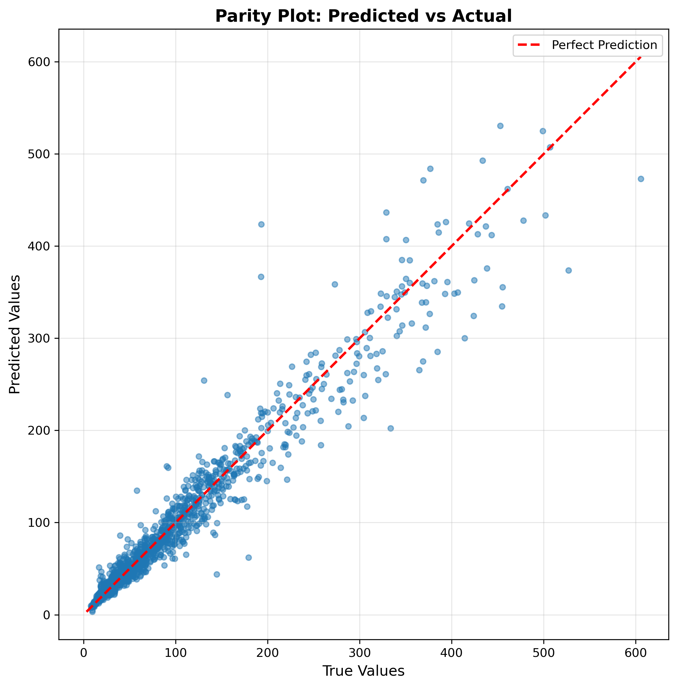
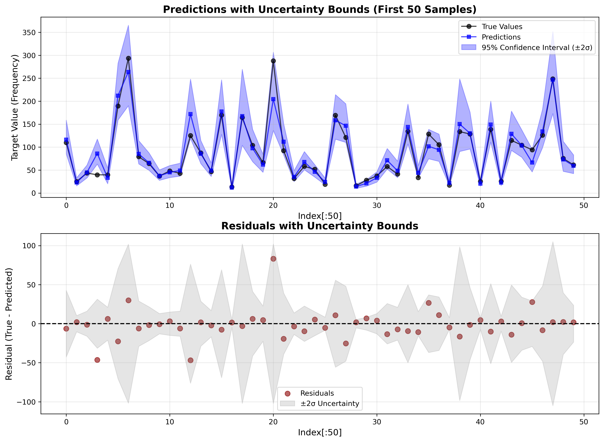
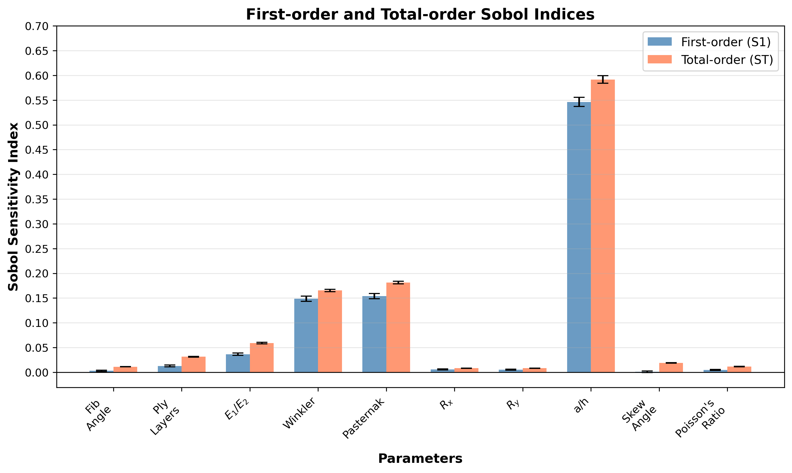
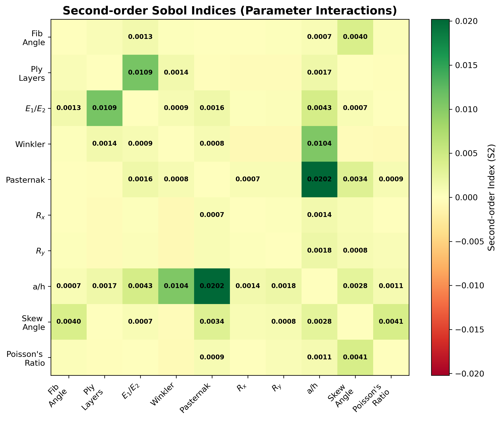

# Gaussian Process Regression with Global Sensitivity Analysis

A modular Python framework for Gaussian Process (GP) regression with uncertainty quantification and Sobol global sensitivity analysis, applied to **skewed laminated composite shell natural frequency prediction**.

[](https://forthebadge.com)
[](https://forthebadge.com)

[](https://www.python.org/)
[](https://scikit-learn.org/)
[](https://matplotlib.org/devdocs/users/index.html)
[](https://matplotlib.org/devdocs/users/index.html)
---

## 📋 Table of Contents

- [Overview](#overview)
- [Features](#features)
- [Project Structure](#project-structure)
- [Installation](#installation)
- [Usage](#usage)
- [Configuration](#configuration)
- [Methodology](#methodology)
- [Results](#results)
- [Publications](#publications)
- [Citation](#citation)
- [License](#license)
- [Contact](#contact)

---

## 🎯 Overview

This project implements a **complete machine learning pipeline** for predicting the non-dimensional frequency (Omega) of skewed laminated composite spherical shell using **Gaussian Process Regression** with:

- **Quantile transformation** of input features
- **Log transformation** of target variable (Natural Frequency)
- **Hyperparameter optimization** for GP kernels
- **Uncertainty quantification** with 95% confidence intervals
- **Variance decomposition based global sensitivity analysis** to identify influential parameters

The framework is designed for **structural engineering applications** but can be adapted to any regression problem requiring uncertainty quantification and sensitivity analysis.
<center>
    
<center>
---

## ✨ Features

### Core Capabilities

- ✅ **Modular Design**: Clean separation of data loading, model training, evaluation, and sensitivity analysis
- ✅ **Advanced GP Kernels**: Support for RBF, Matérn, RationalQuadratic, and combined kernels
- ✅ **Uncertainty Quantification**: Predictions with standard deviations and confidence intervals
- ✅ **Global Sensitivity Analysis**: Sobol indices (first-order, total-order, second-order interactions)
- ✅ **Comprehensive Visualizations**: Prediction plots, parity plots, residual analysis, sensitivity heatmaps
- ✅ **Reproducible Research**: Fixed random seeds and saved models for reproducibility
- ✅ **Production-Ready**: Model persistence with joblib for deployment

## 📂 Project Structure

```
gp_pipeline_project/
├── main.py                          # Main execution script
├── config.py                        # Configuration parameters
├── requirements.txt                 # Python dependencies
├── environment.yml                  # Conda environment specification
├── README.md                        # This file
│
├── utils/                           # Utility modules
│   ├── __init__.py
│   ├── data_loader.py              # Data loading and preprocessing
│   ├── transformers.py             # LogTransformer, GPRegressorWithStd
│   ├── kernels.py                  # GP kernel definitions
│   ├── model_training.py           # Training and evaluation functions
│   ├── plotting.py                 # Visualization functions
│   └── sensitivity_analysis.py     # Sobol analysis functions
│
├── data/                            # Input data directory
│   └── example.csv                     # Example dataset (place your data here)
│
└── outputs/                         # Output directory
    ├── models/                     # Trained model files (.pkl)
    ├── figures/                    # Visualizations (.png, .pdf, .svg)
    └── results/                    # Analysis results (.json)
        └── sensitivity_indices.json
```

---

## 🔧 Installation

### Prerequisites

- Python 3.8 or higher
- Anaconda or Miniconda (recommended) or pip

### Using Conda

```bash
# Clone the repository
git clone <repository-url>
cd gp_pipeline_project
```
```bash
# Create conda environment
conda env create -f environment.yml
```
```bash
# Activate environment
conda activate gp_env
```

### Requirements

```
numpy>=1.21.0
pandas>=1.3.0
matplotlib>=3.4.0
seaborn>=0.11.0
scikit-learn>=1.5.0
joblib>=1.0.0
```

---

## 🚀 Usage

### Quick Start

1. **Place your data** in the `data/` directory as `example.csv` (or modify `config.py`)

2. **Run the complete pipeline**:

```bash
python main.py
```

This will:
- Load and preprocess data
- Train GP model with optimal kernel
- Evaluate on test set
- Perform Sobol sensitivity analysis
- Generate all visualizations
- Save model and results

<!-- ### Step-by-Step Execution

You can also run individual components:

```python
# Import modules
from config import *
from utils.data_loader import load_and_prepare_data
from utils.transformers import LogTransformer, GPRegressorWithStd
from utils.model_training import train_model, evaluate_model

# Load data
data_config = {**DATA_CONFIG, 'random_state': RANDOM_STATE}
data = load_and_prepare_data(data_config)

# Train model
log_transformer = LogTransformer()
# ... (see main.py for complete example)
```

### Loading Saved Model

```python
from utils.model_training import load_model

# Load saved artifacts
artifacts = load_model('outputs/models/gp_model_optimized.pkl')
pipeline = artifacts['pipeline']
log_transformer = artifacts['qt_y']

# Make predictions
X_new = ...  # Your new data
X_transformed = pipeline.named_steps['quantile_transform'].transform(X_new)
y_pred_scaled = pipeline.named_steps['gp_regressor'].predict(X_transformed, return_std=True)
y_pred = log_transformer.inverse_transform(y_pred_scaled)
```

--- -->

## ⚙️ Configuration

All parameters are centralized in `config.py`:

### Data Configuration

```python
DATA_CONFIG = {
    'data_path': 'data/sph.csv',
    'stratify_column': 'Strat_cat',
    'sample_fraction': 0.5,
    'train_size': 0.5,
    'cv_test_split': 0.5,
}
```

### GP Model Configuration

```python
GP_MODEL_CONFIG = {
    'alpha': 1e-10,                 # Noise level
    'n_restarts_optimizer': 10,     # Hyperparameter optimization restarts
    'normalize_y': False,
}

DEFAULT_KERNEL = 'rbf_plus_matern'  # Best for structural mechanics
```

### Sensitivity Analysis Configuration

```python
SENSITIVITY_CONFIG = {
    'feature_names': ['Fiber_Angle', 'No_of_Ply', ...],
    'bounds': [[0, 90], [2, 16], ...],
    'n_samples': 4096,
    'calc_second_order': True,
}
```

---

## 📊 Methodology

### 1. Data Preprocessing

- **Stratified sampling**: Ensures balanced representation of foundation types
- **Train/CV/Test split**: 50% / 25% / 25% with stratification
- **Feature transformation**: QuantileTransformer maps features to normal distribution
- **Target transformation**: Log1p transformation for handling skewed distribution

### 2. Gaussian Process Regression

#### Kernel Selection

The project supports multiple kernels:

- **RBF (Radial Basis Function)**: Captures smooth global trends
- **Matérn (ν=1.5, 2.5)**: Models less smooth functions and generalised global trends

Default: `matern_2.5` (best test metrics)

#### Hyperparameter Optimization

- **Length scales**: (1e-2, 1e2) bounds
- **Constant values**: (1e-3, 1e3) bounds
- **Noise levels**: (1e-10, 1e0) bounds
- **10 random restarts** for robust optimization

### 3. Uncertainty Quantification

Predictions include:
- **Mean prediction**: E[y|X]
- **Standard deviation**: σ(y|X)
- **95% confidence intervals**: μ ± 2σ

### 4. Sobol Sensitivity Analysis

**Sobol indices** quantify parameter importance:

- **S₁ (First-order)**: Direct effect of i^{th} parameter
- **Sₜ (Total-order)**: Total effect including interactions
- **S₂ (Second-order)**: Pairwise interactions between parameters

---
## Performance Benchmarks

### Typical Runtimes (on standard laptop)

| Task | Time | Notes |
|------|------|-------|
| Data loading | <1s | 5000 samples |
| GP training | 30-60s | 2500 train samples, 10 features |
| Test evaluation | <5s | 1250 test samples |
| Sobol sampling | <1s | 1024 base samples |
| Model evaluation on Sobol samples | 5 - 10 min | ~50k samples |
| Sobol analysis | <60s | Computing indices |
| Total pipeline | 15-20 min | Complete workflow |

### Memory Requirements

- **Minimum**: 16 GB RAM
- **Recommended**: 32 GB RAM
- **Data size**: Can handle up to 500k samples with 32 GB RAM

---


## 📈 Results

#### 1. Parity Plot
<center>

<center>
*Figure 1: Predicted vs actual deflection values. Points close to the diagonal indicate accurate predictions. R² = 0.94, MAE = 12.8, RMSE = 23.0*

#### 2. Predictions with Uncertainty Bounds
<center>

<center>
*Figure 2a: GP predictions (blue) vs true values (black) with 95% confidence intervals of first 50 test indices. The model captures the frequency with well-calibrated uncertainty estimates.*

<center>
    
<center>
*Figure 2b: GP predictions (blue) vs true values (black) with 95% confidence intervals of first 50 test indices sorted by target (Y) values.*

#### 3. Sobol Sensitivity Indices
<center>

<center>
*Figure 3: First-order (S₁) and total-order (Sₜ) Sobol indices. Thickness (a/h) and elastic foundations are the most influential parameters.*

#### 4. Second-Order Interactions Heatmap
<center>

<center>
*Figure 4: Second-order interaction effects (S₂). Strong interactions observed between a/h (thickness ratio) and elastic foundations.*

---

## 📚 Publications

This research has been submitted/published in:

> - **Journal**: International Journal of Mechanics and Materials in Design
> - **Title**: "Free vibration and kriging uncertainty analysis of skew laminated composite plates resting on elastic foundation having cut-outs and carrying attached mass using FEM"
> - **Authors**: Ghosh, Sabyasachi and Haldar, Salil
> - **DOI**: [[DOI Link](https://doi.org/10.1007/s10999-025-09775-3)]
> - **Year**: 2025

> - **Journal**: Computers \& Structures
> - **Title**: "Free vibration and global sensitivity analysis of perforated composite skew shallow shells on elastic foundations"
> - **Authors**: Ghosh, Sabyasachi and Haldar, Salil
> - **DOI**: [[DOI Link](https://doi.org/10.1016/j.compstruc.2025.107972)]
> - **Year**: 2025


---

## 📖 Citation

If you use this code in your research, please cite:

```bibtex
@article{ghosh2025free,
  title={Free vibration and kriging uncertainty analysis of skew laminated composite plates resting on elastic foundation having cut-outs and carrying attached mass using FEM},
  author={Ghosh, Sabyasachi and Haldar, Salil},
  journal={International Journal of Mechanics and Materials in Design},
  pages={1--33},
  year={2025},
  publisher={Springer Netherlands},
  doi={https://doi.org/10.1007/s10999-025-09775-3}
}
```
```
@article{ghosh2025afree,
  title={Free vibration and global sensitivity analysis of perforated composite skew shallow shells on elastic foundations},
  author={Ghosh, Sabyasachi and Haldar, Salil},
  journal={Computers & Structures},
  volume={318},
  pages={107972},
  year={2025},
  publisher={Elsevier},
  doi={https://doi.org/10.1016/j.compstruc.2025.107972}
}
```

---
## ⚠️ Disclaimer

Accuracy can be further increased by training on higher number of samples, present model has been trained on 3750 samples, having a training time of ~ 7 minutes, using 24 cores CPU and 32 GB RAM. 

---

## 📄 License

This project is licensed under the MIT License - see the LICENSE file for details.

---

## 👤 Contact

**[Your Name]**
- Email: [sabyasachighos@gmail.com]
- GitHub: [@Sabyasachi-Data](https://github.com/Sabyasachi-Data)
- Institution: Indian Institute of Engineering Science and Technology

For questions, issues, or collaboration opportunities, please:
1. Open an issue on GitHub
2. Email the corresponding author

---

**Last Updated**: February 2026
